# Provable Protocol 🎯

> A trustless escrow system for SEO services with automated, verifiable performance validation.

[](https://opensource.org/licenses/MIT)
[](https://soliditylang.org/)
[](https://www.base.org/)
[](https://chain.link/)


---
## 🎯 What is Provable?

**Provable** is a decentralized protocol that eliminates trust issues in SEO service agreements by using smart contracts and oracle-based validation. It ensures that SEO specialists only get paid when they deliver measurable, verifiable results.

### The Problem

- Clients risk paying for SEO services that don't deliver results
- SEO specialists risk not getting paid for legitimate work
- Disputes arise from subjective interpretations of "success"
- Traditional escrow services are slow, expensive, and still require trust

### The Solution

Provable locks payment in a smart contract and automatically validates SEO performance using real, on-chain verified data from sources like Google Search Console, PageSpeed Insights, and ranking APIs. When targets are met, payment is released. When targets are missed, clients get refunded. **No trust required.**

---

## 🔑 How It Works

### Simple 7-Step Process

> **Current Phase:** Steps 1-5 are implemented. Steps 6-7 (automated validation) coming in Phase 2.

1. **Create Offer** - Client defines payment amount, deadline, and freelancer address ✅
2. **Add Metrics** - Client specifies measurable KPIs (rankings, indexed pages, Core Web Vitals, etc.) 🔮
3. **Both Sign** - Client creates job, freelancer signs contract ✅
4. **Lock Funds** - Client locks payment in escrow smart contract (ETH or ERC20) ✅
5. **Work Period** - SEO specialist performs the work (customizable deadline) ✅
6. **Validation** - Chainlink oracle fetches data from APIs and calculates score 🔮
7. **Settlement** - Smart contract automatically pays SEO or refunds client based on results 🔮


✅ = Implemented | 🔮 = Planned

### Payment & Resolution Paths

**Current Implementation:**


**Phase 1 - Manual Period (Currently Implemented)**
Client creates an offer, SEO specialist signs it, funds are locked, work is completed, and client either pays manually or waits for automatic completion after 7-day review period.

```mermaid
flowchart TB
    subgraph manual["MANUAL PERIOD - Phase 1 (Live Now)"]
        subgraph offer_creation["Creating an offer and terms"]
            Client1[Client]
            CreateOffer[Create an offer<br/>- from preset or<br/>custom values]
            SeeOffer[See and choose<br/>the offer<br/>signs it]
            SEOSpec1[SEO spec.]
            
            Client1 -->|create<br/>an offer<br/>with<br/>terms<br/>and<br/>payment| CreateOffer
            CreateOffer --> SeeOffer
            SEOSpec1 -->|sign it| SeeOffer
        end
        
        subgraph lock_funds["Locking funds - contract execution"]
            Client2[Client]
            LockFunds[Lock funds<br/>start the job<br/>period of one week]
            
            SeeOffer --> LockFunds
            Client2 -->|locking full<br/>amount<br/>100$| LockFunds
        end
        
        subgraph working["Working... (1 week period)"]
            SEOSpec2[SEO spec.]
            JobDoneDecision{SEO spec clicks<br/>'Job Done'?}
            JobDoneBtn[Job marked as done<br/>by SEO spec.]
            NoJobDone[SEO spec didn't<br/>click 'Job Done']
            
            LockFunds --> JobDoneDecision
            SEOSpec2 --> JobDoneDecision
            JobDoneDecision -->|Yes| JobDoneBtn
            JobDoneDecision -->|No| NoJobDone
        end
        
        subgraph mark_done["Manual Payout Option"]
            Client3[Client]
            ManualPayout{Client pays<br/>manually?}
            PayoutNow[Client clicks payout<br/>SEO spec gets paid]
            WaitForAuto[Wait 1 day<br/>No manual payout]
            AutoRefund[Manual Payout Period ends<br/>Automatic refund to Client]
            
            JobDoneBtn --> ManualPayout
            Client3 --> ManualPayout
            ManualPayout -->|Yes| PayoutNow
            ManualPayout -->|No| WaitForAuto
            NoJobDone --> AutoRefund
        end
        
        subgraph endpoints["Endpoints"]
            ManualSuccess[✓ Manual Payout<br/>Complete]
            RefundComplete[✓ Refund to Client<br/>Complete]
            TriggerAuto[🔄 Triggering Automation...<br/>See: Automated Period diagram]
            
            PayoutNow --> ManualSuccess
            AutoRefund --> RefundComplete
            WaitForAuto --> TriggerAuto
        end
    end
    
    style manual fill:#2a2a2a,stroke:#98F7E9,stroke-width:3px
    style offer_creation fill:#1f1f1f,stroke:#98F7E9
    style lock_funds fill:#1f1f1f,stroke:#98F7E9
    style working fill:#1f1f1f,stroke:#98F7E9
    style mark_done fill:#1f1f1f,stroke:#98F7E9
    style endpoints fill:#1f1f1f,stroke:#19D1B6,stroke-width:2px
    
    style Client1 fill:#98F7E9,color:#6D6D6D
    style Client2 fill:#98F7E9,color:#6D6D6D
    style Client3 fill:#98F7E9,color:#6D6D6D
    style SEOSpec1 fill:#98F7E9,color:#6D6D6D
    style SEOSpec2 fill:#98F7E9,color:#6D6D6D
    
    style CreateOffer fill:#19D1B6,color:#ffffff
    style SeeOffer fill:#19D1B6,color:#ffffff
    style LockFunds fill:#19D1B6,color:#ffffff
    style JobDoneDecision fill:#98F7E9,color:#6D6D6D
    style JobDoneBtn fill:#19D1B6,color:#ffffff
    style NoJobDone fill:#b3b3b3,color:#6D6D6D
    style ManualPayout fill:#98F7E9,color:#6D6D6D
    style PayoutNow fill:#19D1B6,color:#ffffff
    style WaitForAuto fill:#b3b3b3,color:#6D6D6D
    style AutoRefund fill:#6D6D6D,color:#ffffff
    
    style ManualSuccess fill:#19D1B6,color:#ffffff
    style RefundComplete fill:#19D1B6,color:#ffffff
    style TriggerAuto fill:#98F7E9,color:#6D6D6D,stroke:#19D1B6,stroke-width:2px,stroke-dasharray: 5 5
```



**Phase 2 - Automated Period**
Chainlink oracles fetch real SEO performance data, calculate a score against predefined targets, and automatically pay the specialist or refund the client—no human judgment needed.

```mermaid
flowchart TB
    subgraph automated["AUTOMATED PERIOD - Phase 2 (Coming Soon)"]
        subgraph handoff["From Manual Period"]
            TriggerPoint[🔄 Automation Triggered<br/>Client didn't pay manually<br/>after 1 day wait]
            
            style TriggerPoint fill:#98F7E9,color:#6D6D6D,stroke:#19D1B6,stroke-width:2px,stroke-dasharray: 5 5
        end
        
        subgraph validation_start["Validation Trigger (Day 1 after Job Done)"]
            Keeper1[Chainlink<br/>keeper]
            Anyone[or anyone]
            StartValidation[Function<br/>startValidation<br/>Triggered 1 day after 'Job Done'<br/>if client didn't pay manually]
            
            TriggerPoint --> StartValidation
            Keeper1 --> StartValidation
            Anyone --> StartValidation
        end
        
        subgraph validation_period["Validation period (30 days)"]
            Keeper2[Chainlink<br/>keeper]
            CheckStatus[During 30 days:<br/>Check website status<br/>and fetch validation data<br/>to calculate score]
            SEOSpec3[SEO spec.]
            SEOSpec4[SEO spec.]
            APICall[Oracle fetches:<br/>• Google Search Console<br/>• SERPApi rankings<br/>• PageSpeed metrics<br/>• Backlink data]
            ScoreCalc[Calculate weighted score<br/>based on targets:<br/>• Keyword rankings<br/>• Indexed pages<br/>• Core Web Vitals<br/>• Traffic metrics]
            
            StartValidation --> CheckStatus
            Keeper2 --> CheckStatus
            SEOSpec3 --> CheckStatus
            CheckStatus --> APICall
            APICall --> ScoreCalc
            ScoreCalc --> SEOSpec4
        end
        
        subgraph settlement["Automated Settlement"]
            ScoreDecision{Score ≥<br/>Threshold?}
            PaySEO[✓ Pay SEO Specialist<br/>Target achieved]
            RefundClient[✓ Refund Client<br/>Target not met]
            
            SEOSpec4 --> ScoreDecision
            ScoreDecision -->|Yes| PaySEO
            ScoreDecision -->|No| RefundClient
        end
    end
    
    style automated fill:#2a2a2a,stroke:#19D1B6,stroke-width:3px
    style handoff fill:#1f1f1f,stroke:#98F7E9,stroke-dasharray: 5 5
    style validation_start fill:#1f1f1f,stroke:#19D1B6
    style validation_period fill:#1f1f1f,stroke:#19D1B6
    style settlement fill:#1f1f1f,stroke:#19D1B6,stroke-width:2px
    
    style Keeper1 fill:#19D1B6,color:#ffffff
    style Keeper2 fill:#19D1B6,color:#ffffff
    style Anyone fill:#98F7E9,color:#6D6D6D
    style SEOSpec3 fill:#98F7E9,color:#6D6D6D
    style SEOSpec4 fill:#98F7E9,color:#6D6D6D
    
    style StartValidation fill:#19D1B6,color:#ffffff
    style CheckStatus fill:#19D1B6,color:#ffffff
    style APICall fill:#19D1B6,color:#ffffff
    style ScoreCalc fill:#19D1B6,color:#ffffff
    style ScoreDecision fill:#98F7E9,color:#6D6D6D
    style PaySEO fill:#19D1B6,color:#ffffff
    style RefundClient fill:#19D1B6,color:#ffffff
```



---


## 📊 Validation System (Phase 2 - In Development)

### Planned Metrics

**Google Search Console Integration (In Development):**
- **Indexed Pages** - Number of pages indexed by Google
- **Search Performance** - Clicks, impressions, CTR, average position
- **Core Web Vitals** - LCP, FID, CLS scores from real user data
- **Mobile Usability** - Mobile-friendly test results
- **Coverage Issues** - Index coverage and crawling errors

**Additional Metrics (Future):**
- **Keyword Rankings** - Position in Google search results (SERPApi)
- **Domain Rating** - Backlink authority score (third-party APIs)
- **Technical Score** - SEO audit score (0-100)
- **Backlinks Count** - Quality backlinks acquired
- **Page Speed** - Loading time improvements (PageSpeed Insights)

### Weighted Scoring System

Each metric has:
- **Baseline Value** - Starting point (recorded at contract creation)
- **Target Value** - Goal to achieve
- **Weight** - Importance percentage (all weights must sum to 100%)

**Example:**
```
Metric 1: Keyword "SEO services" from position 45 → 10 (Weight: 40%)
Metric 2: Indexed pages from 50 → 100 (Weight: 30%)
Metric 3: Core Web Vitals from 60 → 90 (Weight: 30%)

If achieved:
- Metric 1: 100% × 40% = 40 points
- Metric 2: 70% × 30% = 21 points
- Metric 3: 100% × 30% = 30 points
Total Score: 91/100 → PASS ✅
```

Threshold set at contract creation (e.g., 70%). Score ≥ Threshold = SEO gets paid.

---

## 🏗️ Architecture

### Core Smart Contracts

**Currently Implemented:**
- `SEOEscrow.sol` - Main escrow logic with Chainlink Automation integration
- `SEOFinance.sol` - Financial custody for ETH and ERC20 tokens with fee system
- `SEOArbiter.sol` - Dispute resolution system with arbiter whitelist
- `SEORegistry.sol` - Token whitelist management for approved payment tokens
- `Constants.sol` - Platform configuration (fees, limits, timeouts)
- Chainlink Automation - Auto-completion after 7-day review period

**Placeholder Contracts (Not Implemented):**
- `SEOValidationOracle.sol` - Oracle integration for API data fetching
- `ScoreCalculations.sol` - Weighted scoring algorithms

**Active Development (Phase 2):**
- 🔄 **Google Search Console API** - Indexing and search performance data (IN DEVELOPMENT)
- ⏳ Chainlink Functions - Executes off-chain API calls for SEO metrics
- ⏳ SERPApi - Keyword ranking positions  
- ⏳ PageSpeed Insights API - Core Web Vitals and performance metrics

**Architecture Flow:**
```
Client ⇄ SEOEscrow ⇄ SEOFinance (Payment Handling + Fees)
                  ⇄ SEOArbiter (Dispute Resolution)
                  ⇄ SEORegistry (Token Whitelist)
                  ⇄ Constants (Platform Config)
                  ⇄ Chainlink Automation (Auto-completion)
                  ⇄ SEOValidationOracle (Phase 2 - In Development)
                        ⇄ Google Search Console API (In Development)
```

---

## 🛡️ Security & Trust

### Trustless by Design

- **No Custodian** - Funds held in smart contract, not by a company
- **Immutable Terms** - Contract conditions can't be changed after signing
- **Verifiable Results** - All validation data stored on IPFS with hash on-chain
- **Transparent Process** - Every step recorded on blockchain
- **Automated Execution** - No human can manipulate the outcome

### Attack Prevention

- **Reentrancy Protection** - SafeMath and checks-effects-interactions pattern
- **Access Control** - Role-based permissions for critical functions
- **Oracle Security** - Multiple data sources, outlier detection
- **Timeout Protection** - Validation must complete within time limit
- **Dispute Mechanism** - Manual resolution available for edge cases

### Current Security Implementation

- ✅ Built with OpenZeppelin security standards (ReentrancyGuard, SafeERC20)
- ✅ Separation of concerns (escrow logic isolated from financial custody)
- ✅ Role-based access control (client, freelancer, arbiter modifiers)
- 🔄 Test coverage in development
- 🔮 Chainlink oracle integration planned
- 🔮 Formal verification planned for future releases

---

## 💰 Economics

### Current Fee Structure

- **2.5% platform fee** on all deposits (deducted automatically when funds are locked)
- **0% fee** on refunds (client gets full amount back)
- **No upfront costs** - Pay only when deals complete
- **Fee collection** - Fees are sent to designated `feeCollector` address

> Note: Platform fee system is implemented and active. Advanced treasury management features planned for future releases.

### Who Benefits?

**Clients:**
- Only pay for proven results
- No risk of losing money to poor service
- Transparent pricing with no hidden fees

**SEO Specialists:**
- Get paid fairly when targets are met
- Build verifiable reputation on-chain
- Attract more clients with proven track record

**Platform:**
- Sustainable 2.5% fee model
- Revenue scales with transaction volume
- Incentivized to ensure fair outcomes

---

## 🚀 Use Cases

### Perfect For:

✅ **Local SEO Projects** - Rank local businesses for geo-targeted keywords  
✅ **E-commerce SEO** - Improve product page rankings and organic traffic  
✅ **Technical SEO Audits** - Fix site issues and improve Core Web Vitals  
✅ **Link Building Campaigns** - Acquire quality backlinks with DR guarantees  
✅ **Content SEO** - Index optimization and keyword performance  
✅ **SEO Consulting** - Performance-based advisory with measurable KPIs  

### Not Suitable For:

❌ Content creation without measurable metrics  
❌ Brand awareness campaigns (hard to quantify)  
❌ Social media marketing (outside of SEO scope)  
❌ Very short-term work (<1 week) - SEO takes time  

---

## 🎯 Why "Provable"?

The name reflects our core principle: **everything must be provable.**

- ✅ Work completion is **provable** through metrics
- ✅ Performance improvement is **provable** through data
- ✅ Fair payment is **provable** through smart contracts
- ✅ Transaction history is **provable** on blockchain

**No opinions. No disputes. Just provable results.**

---

## 🔮 Vision

Provable aims to become the standard infrastructure for performance-based service agreements, starting with SEO but expanding to:

- Digital marketing (PPC, Social Media ROI)
- Software development (code quality metrics)
- Freelance services (deliverable-based payment)
- Consulting (outcome-based fees)

By bringing transparency and automation to service agreements, we create a fairer economy where:
- Quality providers get rewarded
- Poor performers get filtered out
- Clients get peace of mind
- Everyone saves time and money

---

## 📋 Project Status

### ✅ Phase 1: Core Escrow (IMPLEMENTED)

**Completed:**
- ✅ Smart contract architecture design
- ✅ SEOEscrow: Complete job lifecycle management with Chainlink Automation
- ✅ SEOFinance: ETH and ERC20 token custody with platform fees (2.5%)
- ✅ SEOArbiter: Dispute resolution system with arbiter whitelist
- ✅ SEORegistry: Token whitelist management system
- ✅ Constants: Platform configuration and constants
- ✅ Chainlink Automation: Auto-completion after 7-day review period
- ✅ Next.js 15 frontend with App Router
- ✅ Coinbase OnchainKit wallet integration
- ✅ Farcaster MiniApp SDK integration
- ✅ Complete UI component library with dark mode design system
- ✅ Home page, offers page, and profile page structure
- ✅ Bottom navigation and responsive layout
- ✅ Comprehensive test suite for all core contracts

**In Progress:**
- 🔄 Frontend-contract integration (connecting UI to deployed contracts)
- 🔄 Contract deployment scripts and documentation
- 🔄 Final testing and security review

### 🔮 Phase 2: Validation System (IN DEVELOPMENT)

**Currently Planning/Implementing:**
- 🔄 **Google Search Console API Integration** - Primary focus for automatic SEO metric validation
- ⏳ SEOValidationOracle: Chainlink Functions for API data fetching
- ⏳ ScoreCalculations: Weighted metric scoring algorithms
- ⏳ Automated metric validation and scoring system

**Next in Queue:**
- ⏳ Additional API integrations (SERPApi, PageSpeed Insights)  
- ⏳ IPFS integration for storing validation data
- ⏳ Enhanced frontend for metric selection and monitoring

**Current Status:** Google Search Console API integration in active development. Placeholder contracts being replaced with working implementations.

### 🚀 Phase 3: Advanced Features (FUTURE)

**Long-term Roadmap:**
- 📅 Reputation system for SEO specialists
- 📅 Multi-chain deployment (Polygon, Arbitrum, Optimism)
- 📅 Job template marketplace
- 📅 Advanced dispute resolution with DAO governance
- 📅 White-label solutions for agencies
- 📅 Integration with other service categories (dev, marketing, design)

---

## 🛠️ Development

### Prerequisites

- [Foundry](https://book.getfoundry.sh/getting-started/installation) for smart contract development
- [Node.js](https://nodejs.org/) (v18+) for frontend development
- Git for version control

### Quick Start

**Smart Contracts:**
```bash
# Install Foundry dependencies
forge install

# Build contracts
forge build

# Run tests
forge test -vvv

# Run with gas reporting
forge test --gas-report

# Format code
forge fmt

# Generate coverage
forge coverage --report summary
```

**Frontend (Farcaster MiniApp):**
```bash
# Navigate to frontend directory
cd Provable

# Install dependencies
npm install

# Run development server (http://localhost:3000)
npm run dev

# Build for production
npm run build

# Start production server
npm start

# Run linter
npm run lint

# Run tests
npm test

# Run tests with coverage
npm run test:coverage
```

### Project Structure

```
.
├── src/                          # Solidity smart contracts
│   ├── SEOEscrow.sol            # ✅ Main escrow controller + Chainlink Automation
│   ├── SEOFinance.sol           # ✅ Payment handling
│   ├── SEOArbiter.sol           # ✅ Dispute resolution
│   ├── SEORegistry.sol          # ✅ Token whitelist management
│   ├── Constants.sol            # ✅ Platform constants
│   ├── SEOValidationOracle.sol  # 🔄 [IN DEVELOPMENT] Oracle integration
│   ├── ScoreCalculations.sol    # ⏳ [PLACEHOLDER] Scoring logic
│   └── interfaces/              # Contract interfaces
├── test/                         # Foundry tests
│   ├── BaseTest.sol             # Base test setup
│   ├── SEOEscrow.t.sol          # Escrow contract tests
│   ├── SEOFinance.t.sol         # Finance contract tests
│   ├── SEOArbiter.t.sol         # Arbiter contract tests
│   └── SEORegistry.t.sol        # Registry contract tests
├── Provable/                     # ✅ Next.js 15 frontend (App Router)
│   ├── app/                     # Pages: home, offers, profile
│   ├── components/              # React components (UI + BottomNavbar)
│   ├── minikit.config.ts        # Farcaster MiniApp config
│   └── package.json             # Frontend dependencies
├── lib/                          # Foundry deps (forge-std, OpenZeppelin, Chainlink)
├── foundry.toml                  # Foundry configuration
└── remappings.txt                # Import path remappings
```

**Note:** The frontend directory is named `Provable/` but the project was originally called `SEOsolver`. Both names may appear in code.

**Legend:** ✅ = Implemented | ⏳ = Placeholder/Planned | 🔄 = In Development

### Testing

```bash
# Run all tests
forge test -vvv

# Run specific test
forge test --match-test testJobCreation -vvv

# Run with stack traces
forge test -vvvv

# Watch mode
forge test --watch
```

### Deployment

> ⚠️ Note: Deployment scripts are under development. The contracts have circular dependencies that require careful deployment ordering.

```bash
# Start local Anvil node
anvil

# Deploy to local/testnet (when scripts are ready)
forge script script/Deploy.s.sol --rpc-url <RPC_URL> --private-key <PRIVATE_KEY> --broadcast
```

### Documentation

- [Foundry Book](https://book.getfoundry.sh/) - Smart contract framework docs
- [OnchainKit](https://docs.base.org/onchainkit) - Frontend blockchain toolkit

---

## ⚠️ Current Limitations

### Phase 1 Limitations

**Smart Contracts:**
- ⚠️ **Manual validation only** - Oracle-based SEO metric validation not yet implemented
- ⚠️ **Fixed review period** - 7-day review period is hardcoded (future: configurable)
- ⚠️ **Single arbiter system** - Dispute resolution requires whitelisted arbiters (future: DAO governance)
- ⚠️ **Limited token support** - Only whitelisted ERC20 tokens + ETH (future: dynamic token addition)

**Frontend:**
- ⚠️ **Development stage** - UI exists but contract integration incomplete
- ⚠️ **Limited wallet support** - Currently Coinbase Wallet focused (future: multi-wallet)
- ⚠️ **No mobile optimization** - Desktop-first design (responsive but not mobile-native)

**Security:**
- ⚠️ **Alpha software** - Comprehensive security audit pending
- ⚠️ **Testnet only** - Not production-ready for mainnet deployment
- ⚠️ **Limited testing** - Test coverage expanding but not yet comprehensive

### Known Issues

- **Circular dependencies** - SEOEscrow ↔ SEOFinance requires careful deployment order
- **Gas optimization** - Automation batch size limited to 20 jobs for gas efficiency
- **Error handling** - Some edge cases in job state transitions need refinement

---

## 🚀 Deployment Guide

### Prerequisites

```bash
# Install Foundry
curl -L https://foundry.paradigm.xyz | bash
foundryup

# Install Node.js (v18+)
# Install Git
```

### Smart Contract Deployment

⚠️ **IMPORTANT**: Deploy to testnet only. Not production-ready.

**Deployment Order (Critical):**
```bash
# 1. Deploy SEORegistry first
forge create SEORegistry --constructor-args "0xYourAddress"

# 2. Deploy SEOArbiter
forge create SEOArbiter

# 3. Deploy SEOFinance with zero address placeholder
forge create SEOFinance --constructor-args "0x0000000000000000000000000000000000000000" "0xYourFeeCollectorAddress"

# 4. Deploy SEOEscrow
forge create SEOEscrow --constructor-args "$FINANCE_ADDRESS" "$ARBITER_ADDRESS" "$REGISTRY_ADDRESS"

# 5. Set escrow address in finance contract
cast send $FINANCE_ADDRESS "setEscrow(address)" $ESCROW_ADDRESS --private-key $PRIVATE_KEY
```

**Environment Variables:**
```bash
# Required for deployment
export PRIVATE_KEY="your_private_key"
export RPC_URL="https://sepolia.base.org"  # Base Sepolia testnet
export ETHERSCAN_API_KEY="your_etherscan_key"
```

### Frontend Deployment

```bash
cd Provable

# Install dependencies
npm install

# Set environment variables
cp .env.example .env.local
# Edit .env.local with your contract addresses

# Build and deploy
npm run build
npm start
```

### Chainlink Automation Setup

1. **Deploy contracts** following the order above
2. **Register upkeep** at [automation.chain.link](https://automation.chain.link)
   - Target: SEOEscrow contract address  
   - Gas limit: 500,000+
   - Fund with LINK tokens
3. **Monitor** upkeep performance and gas usage

---

## 🤝 Contributing

### Development Setup

```bash
# Clone repository
git clone https://github.com/DappScout/SEOsolver.git
cd SEOsolver

# Install smart contract dependencies
forge install

# Install frontend dependencies
cd Provable && npm install
```

### Development Workflow

1. **Smart Contracts**: Use Foundry for development, testing, and deployment
2. **Frontend**: Use Next.js with TypeScript and Tailwind CSS
3. **Testing**: Write comprehensive tests for all new features
4. **Documentation**: Update README and inline comments

### Contribution Guidelines

- **Security First**: All contributions must maintain security standards
- **Test Coverage**: New features require corresponding tests
- **Code Quality**: Follow existing patterns and conventions
- **Documentation**: Update relevant documentation

---

**Built for the future of trustless service agreements** 🎯
